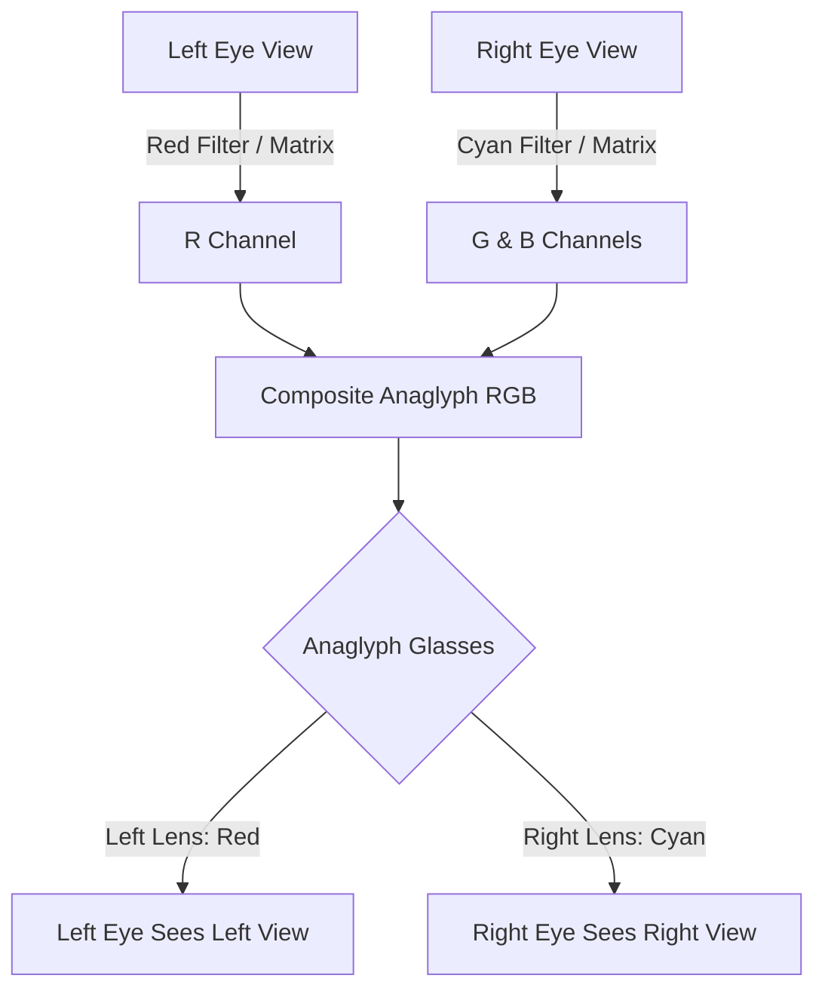
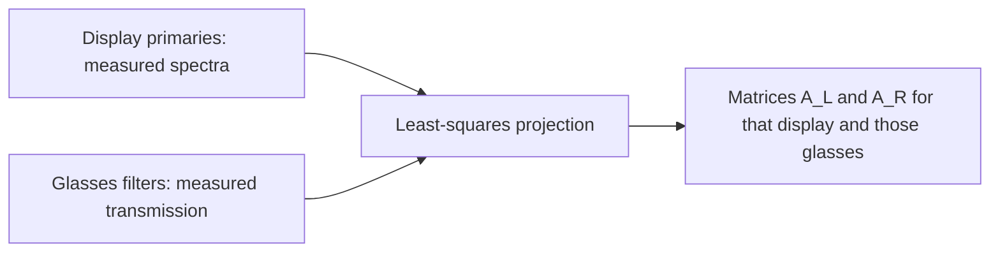

# Anaglyph Color Mathematics, Dubois Optimization, and Display Spectrum Matching

This reference document details the color conversion mathematics, channel crosstalk reduction techniques, Dubois least-squares matrix optimization, and display phosphor/emission adjustments used in anaglyph stereoscopy.

---

## 1. Overview of Anaglyph Multiplexing

Anaglyph stereoscopy multiplexes two distinct eye views into a single RGB color image by assigning different spectral bands to each view.

```
                  +-----------------------+
                  |  Stereo Image Pair    |
                  | (Left Eye, Right Eye) |
                  +-----------+-----------+
                              |
                     Color Multiplexing
                              |
            +-----------------+-----------------+
            |                                   |
   Left Eye (Red Channel)             Right Eye (Cyan: Green+Blue)
            |                                   |
            +-----------------+-----------------+
                              |
                     Composite RGB Output
                              |
                 Anaglyph Viewing Glasses
            +-----------------+-----------------+
            |                                   |
     Red Filter (Blocks G/B)             Cyan Filter (Blocks R)
            |                                   |
      Left Eye Sees                       Right Eye Sees
      Left Picture                        Right Picture
```



---

## 2. Naive vs. Optimized Anaglyph Conversion

### 2.1 Naive Anaglyph Matrix (Simple Channel Copy)

The simplest red/cyan multiplexing copies the red channel from the left-eye image and the green/blue channels from the right-eye image. This is the red-left/cyan-right convention used in the matrix below; swapping the glasses or choosing a cyan-left/red-right output swaps the eye assignment.

```
[ R_out ]   [ 1.0  0.0  0.0 ] [ R_left  ]   [ 0.0  0.0  0.0 ] [ R_right ]
[ G_out ] = [ 0.0  0.0  0.0 ] [ G_left  ] + [ 0.0  1.0  0.0 ] [ G_right ]
[ B_out ]   [ 0.0  0.0  0.0 ] [ B_left  ]   [ 0.0  0.0  1.0 ] [ B_right ]
```

**Limitations:**
- **Retinal Rivalry:** Bright red or cyan objects cause severe flicker because one eye perceives high brightness while the other sees black.
- **Ghosting (Crosstalk):** Spectral overlap between filter transmission curves and display phosphors causes leakage into the wrong eye.

---

## 3. Dubois Least-Squares Optimized Anaglyph

Eric Dubois (2001) formulated anaglyph creation as a least-squares projection problem that minimizes spectral crosstalk and retinal rivalry based on the spectral sensitivity of the human eye and specific filter/display spectral profiles.

### 3.1 Mathematical Model

Given the spectral response functions of the display $P_r(\lambda), P_g(\lambda), P_b(\lambda)$ and filter transmissivities $F_l(\lambda), F_r(\lambda)$, the Dubois transformation applies $3 \times 3$ linear transform matrices $A_L$ and $A_R$ to linear RGB input vectors (Dubois derives them in linear light, so an exact implementation converts the stored gamma-encoded values to linear first and back after):

$$
\mathbf{C}_{\text{out}} = A_L \mathbf{C}_L + A_R \mathbf{C}_R
$$

### 3.2 FFmpeg's Dubois Red/Cyan Matrices (`stereo3d=...:arcd`)

The coefficients below are FFmpeg's, from `libavfilter/vf_stereo3d.c` (`ANAGLYPH_RC_DUBOIS`, stored as integers over 65536, shown to three decimals). FFmpeg applies them directly to the stored 8-bit values, without converting to linear light first.

```
Left Eye Matrix (A_L):
[  0.456   0.500   0.176 ]
[ -0.040  -0.038  -0.016 ]
[ -0.015  -0.021  -0.005 ]

Right Eye Matrix (A_R):
[ -0.043  -0.088  -0.002 ]
[  0.378   0.734  -0.018 ]
[ -0.072  -0.113   1.226 ]
```

```
          +-----------------------+-----------------------+
          |     Left Eye Input    |    Right Eye Input    |
          |  (R_L, G_L, B_L)      |  (R_R, G_R, B_R)      |
          +-----------+-----------+-----------+-----------+
                      |                       |
                  Matrix A_L              Matrix A_R
                      |                       |
                      +-----------+-----------+
                                  |
                           Sum & Clip [0, 255]
                                  |
                      +-----------v-----------+
                      |  Optimized Anaglyph   |
                      |      RGB Output       |
                      +-----------------------+
```

---

## 4. Display Primary and Filter Spectrum Matching

Dubois's method takes two measured inputs: the spectra of the display's three primaries and the transmission of the glasses' two filters. A matrix fitted to one display and one pair of glasses leaks more on another, which is why anaglyph tools ship separate matrices for different display types (a CRT's phosphors and a modern LCD's or OLED's primaries differ) and different glasses.

```
  Display primaries P_r, P_g, P_b (lambda)      Glasses filters F_l, F_r (lambda)
                   |                                        |
                   +------------------+---------------------+
                                      |
                        Least-squares projection (Dubois)
                                      |
                        Matrices A_L, A_R for that pair
```



### 4.1 FFmpeg Dubois Filter Variants

FFmpeg implements several Dubois filter algorithms via the `stereo3d` filter:

- `arcd`: Dubois Anaglyph Red/Cyan (optimized least-squares)
- `agmd`: Dubois Anaglyph Green/Magenta
- `aybd`: Dubois Anaglyph Amber/Blue (ColorCode 3D)

Example invocation:
```bash
ffmpeg -i input_sbs.mp4 -vf "stereo3d=sbs2l:arcd" -c:v libx264 anaglyph_dubois.mp4
```

---

## References

- Dubois, Eric. *"A projection method to generate anaglyph stereo images."* IEEE International Conference on Acoustics, Speech, and Signal Processing (ICASSP), 2001.
- Woods, Andrew J., and Rourke, Tegan. *"Ghosting in anaglyphic stereoscopic images."* Proceedings of SPIE 5291, Stereoscopic Displays and Virtual Reality Systems XI, 2004.
- FFmpeg, [`libavfilter/vf_stereo3d.c`](https://github.com/FFmpeg/FFmpeg/blob/master/libavfilter/vf_stereo3d.c) (`ANAGLYPH_RC_DUBOIS`, `ana_convert`).
