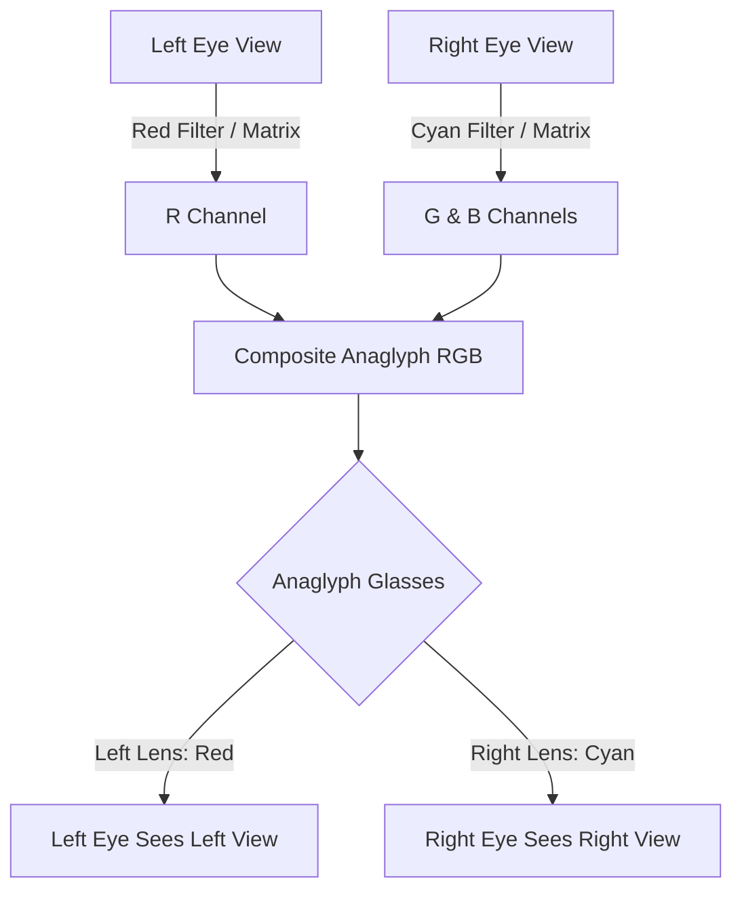
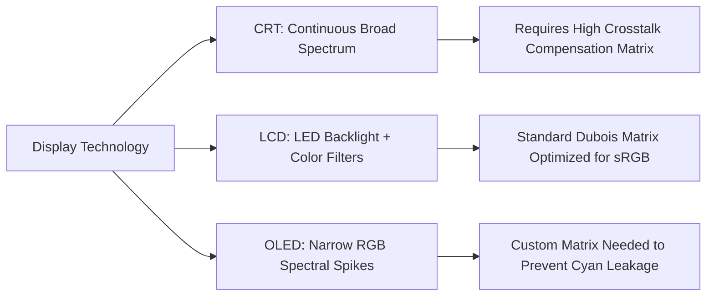

# Anaglyph Color Mathematics, Dubois Optimization, and Display Phosphor Matching

This reference document details the color conversion mathematics, channel crosstalk reduction techniques, Dubois least-squares matrix optimization, and display phosphor/emission adjustments used in anaglyph stereoscopy.

---

## 1. Overview of Anaglyph Multiplexing

Anaglyph stereoscopy multiplexes two distinct eye views into a single RGB color image by assigning different spectral bands to each view.

```
                  +-----------------------+
                  |  Stereo Image Pair    |
                  | (Left Eye, Right Eye) |
                  +-----------+-----------+
                              |
                     Color Multiplexing
                              |
            +-----------------+-----------------+
            |                                   |
   Left Eye (Red Channel)             Right Eye (Cyan: Green+Blue)
            |                                   |
            +-----------------+-----------------+
                              |
                     Composite RGB Output
                              |
                 Anaglyph Viewing Glasses
            +-----------------+-----------------+
            |                                   |
     Red Filter (Blocks G/B)             Cyan Filter (Blocks R)
            |                                   |
      Left Eye Sees                       Right Eye Sees
      Left Picture                        Right Picture
```



---

## 2. Naive vs. Optimized Anaglyph Conversion

### 2.1 Naive Anaglyph Matrix (Simple Channel Copy)

The simplest red/cyan multiplexing copies the Red channel from the Left Eye image and Green/Blue channels from the Right Eye image:

```
[ R_out ]   [ 1.0  0.0  0.0 ] [ R_left  ]   [ 0.0  0.0  0.0 ] [ R_right ]
[ G_out ] = [ 0.0  0.0  0.0 ] [ G_left  ] + [ 0.0  1.0  0.0 ] [ G_right ]
[ B_out ]   [ 0.0  0.0  0.0 ] [ B_left  ]   [ 0.0  0.0  1.0 ] [ B_right ]
```

**Limitations:**
- **Retinal Rivalry:** Bright red or cyan objects cause severe flicker because one eye perceives high brightness while the other sees black.
- **Ghosting (Crosstalk):** Spectral overlap between filter transmission curves and display phosphors causes leakage into the wrong eye.

---

## 3. Dubois Least-Squares Optimized Anaglyph

Eric Dubois (2001) formulated anaglyph creation as a least-squares projection problem that minimizes spectral crosstalk and retinal rivalry based on the spectral sensitivity of the human eye and specific filter/display spectral profiles.

### 3.1 Mathematical Model

Given the spectral response functions of the display $P_r(\lambda), P_g(\lambda), P_b(\lambda)$ and filter transmissivities $F_l(\lambda), F_r(\lambda)$, the Dubois transformation applies $3 \times 3$ linear transform matrices $A_L$ and $A_R$ to linear RGB input vectors:

$$
\mathbf{C}_{\text{out}} = A_L \mathbf{C}_L + A_R \mathbf{C}_R
$$

### 3.2 Standard Dubois Red/Cyan Conversion Matrices (sRGB)

Standard FFmpeg `stereo3d=al:arcd` uses the Dubois transformation matrices optimized for sRGB displays and standard red/cyan filters:

```
Left Eye Matrix (A_L):
[  0.437  0.449  0.164 ]
[ -0.062 -0.062 -0.024 ]
[ -0.048 -0.050 -0.017 ]

Right Eye Matrix (A_R):
[ -0.011 -0.032 -0.007 ]
[  0.377  0.761  0.009 ]
[ -0.026 -0.093  1.234 ]
```

```
          +-----------------------+-----------------------+
          |     Left Eye Input    |    Right Eye Input    |
          |  (R_L, G_L, B_L)      |  (R_R, G_R, B_R)      |
          +-----------+-----------+-----------+-----------+
                      |                       |
                  Matrix A_L              Matrix A_R
                      |                       |
                      +-----------+-----------+
                                  |
                           Sum & Clip [0, 255]
                                  |
                      +-----------v-----------+
                      |  Optimized Anaglyph   |
                      |      RGB Output       |
                      +-----------------------+
```

---

## 4. Display Phosphor & Spectral Emission Adjustments

Anaglyph filters perform differently depending on whether the display is a CRT phosphor, LCD LED backlight, or OLED panel.

```
+------------------+---------------------------------------------------------+
| Display Type     | Spectral Emission Characteristics                       |
+------------------+---------------------------------------------------------+
| CRT Phosphors    | Broad, continuous spectral emission across RGB bands.    |
| LED-Backlit LCD  | Narrow blue peak with broad phosphor green/red peak.    |
| OLED             | Highly saturated, narrow-band RGB emission spikes.      |
+------------------+---------------------------------------------------------+
```



### 4.1 FFmpeg Dubois Filter Variants

FFmpeg implements several Dubois filter algorithms via the `stereo3d` filter:

- `arcd`: Dubois Anaglyph Red/Cyan (optimized least-squares)
- `agmd`: Dubois Anaglyph Green/Magenta
- `aybd`: Dubois Anaglyph Amber/Blue (ColorCode 3D)

Example invocation:
```bash
ffmpeg -i input_sbs.mp4 -vf "stereo3d=sbs2l:arcd" -c:v libx264 anaglyph_dubois.mp4
```

---

## References

- Dubois, Eric. *"A projection method to generate anaglyph images."* IEEE International Conference on Acoustics, Speech, and Signal Processing (ICASSP), 2001.
- Woods, Andrew, and Rourke, T. *"Ghosting in Anaglyphic Stereoscopic Images."* Centre for Marine Science and Technology, Curtin University, 2004.
- FFmpeg libavfilter `vf_stereo3d.c` implementation.
