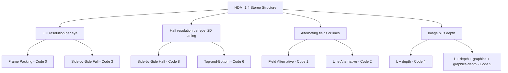
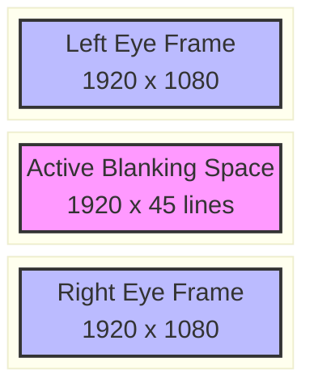
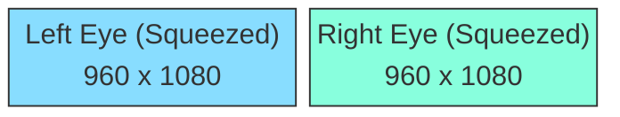
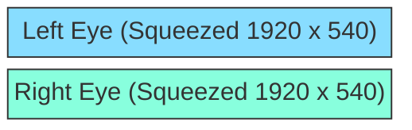
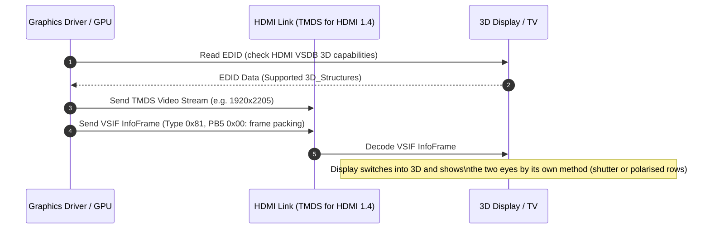

# Visual Guide to Stereo Frame Packing and HDMI Signal Timings

This reference document details the video timing structures, framebuffer layouts, and wire-level transmission formats defined by HDMI 1.4a/1.4b and CTA-861 for stereoscopic 3D delivery. It provides both universal ASCII/Unicode diagrams and enhanced Mermaid diagrams.

For the separate interaction between these stereo timings, bits per component,
chroma formats and link rate, see [Stereo 3D plus Deep Color on HDMI](stereo-deep-colour-link-budget.md).

---

## 1. Overview of HDMI 1.4 Stereoscopic Structures

HDMI 1.4 specifies how stereoscopic 3D frame layouts cross the digital video link: eight structures, each named by a four-bit `3D_Structure` code. They differ in how much of each eye survives the trip.

```
+-------------------------------------------------------------------------------+
|                        HDMI 1.4 Stereo Structures                             |
+---------------------------------------+---------------------------------------+
| Full resolution per eye               | Half resolution per eye, 2D timing    |
|  - Frame Packing (Code 0)             |  - Side-by-Side Half (Code 8)         |
|  - Side-by-Side Full (Code 3)         |  - Top-and-Bottom (Code 6)            |
+---------------------------------------+---------------------------------------+
| Alternating fields or lines           | Image plus depth                      |
|  - Field Alternative (Code 1)         |  - L + depth (Code 4)                 |
|  - Line Alternative (Code 2)          |  - L + depth + graphics (Code 5)      |
+---------------------------------------+---------------------------------------+
```



Mainline Linux creates display modes only for frame packing, top-and-bottom and side-by-side half; the other structures are defined in its HDMI code but not offered as modes.

---

## 2. HDMI Frame Packing Structure (Code 0)

Frame packing combines the Left Eye frame and Right Eye frame into a single oversized vertical raster, separated by the active space the specification defines: the vertical blanking of one 2D frame, carried inside the active picture.

### 2.1 1080p Frame Packing Structure (1920x2205 @ 23.976/24Hz)

```
        Active Width: 1920 pixels
   +-----------------------------------+
   |                                   |  Active Height: 1080 lines
   |          LEFT EYE FRAME           |  (Left Eye)
   |                                   |
   +-----------------------------------+
   |     ACTIVE BLANKING SPACE         |  Active Blanking: 45 lines
   +-----------------------------------+
   |                                   |  Active Height: 1080 lines
   |          RIGHT EYE FRAME          |  (Right Eye)
   |                                   |
   +-----------------------------------+

   Total Frame Raster: 1920 x 2205 pixels (Active)
   Vertical Total Timing (VTOTAL): 2250 lines (including VBLANK)
```



### 2.2 720p Frame Packing Structure (1280x1470 @ 50/59.94/60Hz)

- **Left Eye Active:** 1280 x 720 lines
- **Active Blanking Space:** 30 lines
- **Right Eye Active:** 1280 x 720 lines
- **Total Active Frame:** 1280 x 1470 pixels
- **VTOTAL Timing:** 1500 lines

---

## 3. Frame-Compatible Modes

Frame-compatible modes fit both stereo views inside a standard 2D video frame (e.g., 1920x1080).

### 3.1 Side-by-Side Half (Code 8)

Each view is horizontally squeezed by 50% (960x1080) and packed side-by-side inside a 1920x1080 raster.

```
   +-------------------------+-------------------------+
   |                         |                         |
   |   LEFT EYE (SQUEEZED)   |   RIGHT EYE (SQUEEZED)  |
   |      960 x 1080         |       960 x 1080        |
   |                         |                         |
   +-------------------------+-------------------------+
   <------------------ 1920 pixels -------------------->
```



### 3.2 Top-and-Bottom (Code 6)

Each view is vertically squeezed by 50% (1920x540) and stacked vertically inside a 1920x1080 raster.

```
   +---------------------------------------------------+
   |            LEFT EYE (SQUEEZED 1920x540)           |
   +---------------------------------------------------+
   |            RIGHT EYE (SQUEEZED 1920x540)          |
   +---------------------------------------------------+
   <------------------- 1920 pixels ------------------->
```



### 3.3 Line Alternative

Line alternative (Code 2) carries the left and right eyes on alternating lines. It is a signal structure, not to be confused with a passive (film-patterned retarder) panel's own row interleaving, which the display performs internally from whatever structure arrives.

Column interleaving is not an HDMI `3D_Structure`. It is
`frame_packing_arrangement_type` 1 in the H.264 SEI vocabulary—an example of
two standards using different format lists that must not be merged.

```
   Scanline 0: [ L L L L L L L L L L L L L L L L ] (Left Eye)
   Scanline 1: [ R R R R R R R R R R R R R R R R ] (Right Eye)
   Scanline 2: [ L L L L L L L L L L L L L L L L ] (Left Eye)
   Scanline 3: [ R R R R R R R R R R R R R R R R ] (Right Eye)
```

---

## 4. HDMI Vendor-Specific InfoFrame (VSIF) Signalling

An HDMI sink is told to interpret a compatible video timing as 3D by a Vendor-Specific InfoFrame (VSIF) whose PB4 announces a 3D format. Whether it switches automatically still depends on the sink, the timing and its advertised capabilities. The layout below is the one Linux packs (`hdmi_vendor_infoframe_pack_only()` in `drivers/video/hdmi.c`):

```
+-------------------------------------------------------------------------------+
|                  HDMI Vendor-Specific InfoFrame (VSIF), 3D                    |
+------------+-------------------------------+----------------------------------+
| Byte       | Field                         | Value                            |
+------------+-------------------------------+----------------------------------+
| HB0        | InfoFrame type                | 0x81                             |
| HB1        | Version                       | 0x01                             |
| HB2        | Payload length                | 5, or 6 for side-by-side half    |
| PB0        | Checksum                      | bytes sum to 0 (mod 256)         |
| PB1..PB3   | IEEE OUI of HDMI Licensing    | 0x03 0x0C 0x00 (0x000C03)        |
| PB4        | HDMI_Video_Format, bits [7:5] | 010 = 3D  (PB4 = 0x40)           |
| PB5        | 3D_Structure, bits [7:4]      | 0 frame packing  (PB5 = 0x00)    |
|            |                               | 6 top-and-bottom (PB5 = 0x60)    |
|            |                               | 8 side-by-side half (PB5 = 0x80) |
| PB6        | 3D_Ext_Data, bits [7:4]       | side-by-side half only           |
+------------+-------------------------------+----------------------------------+
```



---

## 5. Common Signal Examples

| Mode | HDMI Code | Horizontal Active | Vertical Active | Vertical Blanking / Gap | Frame Rate |
| :--- | :--- | :--- | :--- | :--- | :--- |
| 1080p Frame Packing | 0 | 1920 px | 2205 lines | 45 lines gap (VTOTAL 2250) | 23.976 / 24 Hz |
| 720p Frame Packing | 0 | 1280 px | 1470 lines | 30 lines gap (VTOTAL 1500) | 50 / 59.94 / 60 Hz |
| Side-by-Side Half | 8 | 1920 px | 1080 lines | Standard VBLANK | 50 / 59.94 / 60 Hz |
| Top-and-Bottom | 6 | 1920 px | 1080 lines | Standard VBLANK | 24 / 50 / 60 Hz |

These are common CTA/HDMI examples, not a universal promise that every sink
accepts every row. The mandatory HDMI 1.4a baseline and any additional
combinations declared by the sink's EDID decide the actual mode set.

---

## References

- HDMI Licensing, LLC, *HDMI Specification Version 1.4a* (2010) and *1.4b* (2011).
- CTA-861-G, *A DTV Profile for Uncompressed High Speed Digital Interfaces*, Consumer Technology Association.
- Linux kernel: [`drivers/video/hdmi.c`](https://github.com/torvalds/linux/blob/master/drivers/video/hdmi.c) (InfoFrame packing), [`drivers/gpu/drm/drm_edid.c`](https://github.com/torvalds/linux/blob/master/drivers/gpu/drm/drm_edid.c) (3D modes from the EDID), [`include/linux/hdmi.h`](https://github.com/torvalds/linux/blob/master/include/linux/hdmi.h) (structure codes).
