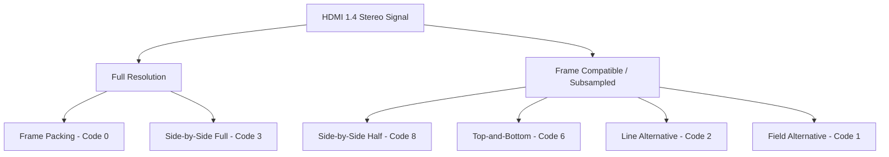
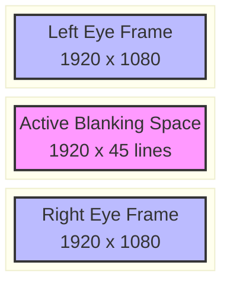
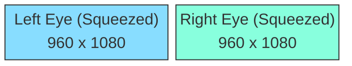
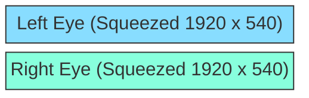
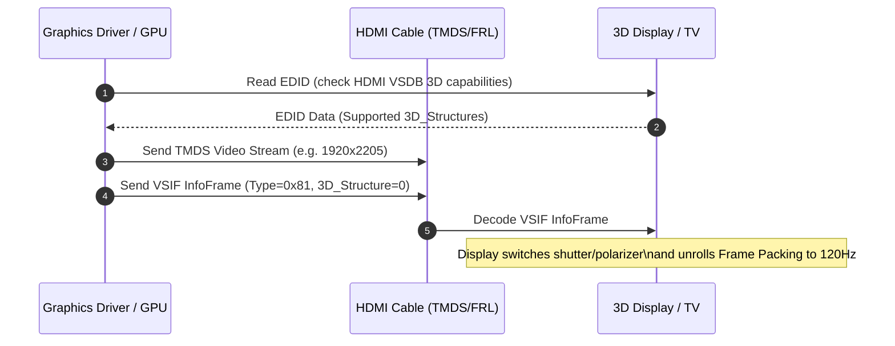

# Visual Guide to Stereo Frame Packing and HDMI Signal Timings

This reference document details the video timing structures, framebuffer layouts, and wire-level transmission formats defined by HDMI 1.4a/1.4b and CTA-861 for stereoscopic 3D delivery. It provides both universal ASCII/Unicode diagrams and enhanced Mermaid diagrams.

---

## 1. Overview of HDMI 1.4 Stereoscopic Structures

HDMI 1.4 specifies how stereoscopic 3D frame layouts cross the digital video link. The frame structure determines whether views retain full resolution or share spatial bandwidth.

```
+-------------------------------------------------------------------------------+
|                        HDMI 1.4 Stereo Structure Modes                        |
+------------------------------+------------------------------------------------+
| Full-Resolution Modes        | Subsampled / Frame-Compatible Modes            |
+------------------------------+------------------------------------------------+
| - Frame Packing (Code 0)     | - Side-by-Side Half (Code 8)                   |
| - Side-by-Side Full (Code 3) | - Top-and-Bottom (Code 6)                      |
|                              | - Line Alternative (Code 2)                    |
|                              | - Field Alternative (Code 1)                   |
+------------------------------+------------------------------------------------+
```



---

## 2. HDMI Frame Packing Structure (Code 0)

Frame packing combines the Left Eye frame and Right Eye frame into a single oversized vertical raster, separated by a active-blanking space defined by the specification.

### 2.1 1080p Frame Packing Structure (1920x2205 @ 23.976/24Hz)

```
        Active Width: 1920 pixels
   +-----------------------------------+
   |                                   |  Active Height: 1080 lines
   |          LEFT EYE FRAME           |  (Left Eye)
   |                                   |
   +-----------------------------------+
   |     ACTIVE BLANKING SPACE         |  Active Blanking: 45 lines
   +-----------------------------------+
   |                                   |  Active Height: 1080 lines
   |          RIGHT EYE FRAME          |  (Right Eye)
   |                                   |
   +-----------------------------------+

   Total Frame Raster: 1920 x 2205 pixels (Active)
   Vertical Total Timing (VTOTAL): 2250 lines (including VBLANK)
```



### 2.2 720p Frame Packing Structure (1280x1470 @ 50/59.94/60Hz)

- **Left Eye Active:** 1280 x 720 lines
- **Active Blanking Space:** 30 lines
- **Right Eye Active:** 1280 x 720 lines
- **Total Active Frame:** 1280 x 1470 pixels
- **VTOTAL Timing:** 1500 lines

---

## 3. Frame-Compatible Modes

Frame-compatible modes fit both stereo views inside a standard 2D video frame (e.g., 1920x1080).

### 3.1 Side-by-Side Half (Code 8)

Each view is horizontally squeezed by 50% (960x1080) and packed side-by-side inside a 1920x1080 raster.

```
   +-------------------------+-------------------------+
   |                         |                         |
   |   LEFT EYE (SQUEEZED)   |   RIGHT EYE (SQUEEZED)  |
   |      960 x 1080         |       960 x 1080        |
   |                         |                         |
   +-------------------------+-------------------------+
   <------------------ 1920 pixels -------------------->
```



### 3.2 Top-and-Bottom (Code 6)

Each view is vertically squeezed by 50% (1920x540) and stacked vertically inside a 1920x1080 raster.

```
   +---------------------------------------------------+
   |            LEFT EYE (SQUEEZED 1920x540)           |
   +---------------------------------------------------+
   |            RIGHT EYE (SQUEEZED 1920x540)          |
   +---------------------------------------------------+
   <------------------- 1920 pixels ------------------->
```



### 3.3 Line Alternative & Column Interleaving

Line alternative (Code 2) interleave left and right eye lines alternately in scanlines. Passive FPR (Film-patterned Retarder) LCD screens match this line structure directly.

```
   Scanline 0: [ L L L L L L L L L L L L L L L L ] (Left Eye)
   Scanline 1: [ R R R R R R R R R R R R R R R R ] (Right Eye)
   Scanline 2: [ L L L L L L L L L L L L L L L L ] (Left Eye)
   Scanline 3: [ R R R R R R R R R R R R R R R R ] (Right Eye)
```

---

## 4. HDMI Vendor-Specific InfoFrame (VSIF) Signalling

Hardware displays switch to 3D mode upon receiving an HDMI Vendor-Specific InfoFrame (VSIF) with PB4 indicating 3D format:

```
+-------------------------------------------------------------------+
|               HDMI Vendor-Specific InfoFrame (VSIF)               |
+------------+-------------------------------+----------------------+
| Byte Index | Field Name                    | Value / Definition   |
+------------+-------------------------------+----------------------+
| HB0        | InfoFrame Type                | 0x81                 |
| HB1        | Version                       | 0x01                 |
| HB2        | Length                        | 0x05 or 0x06         |
| PB1..PB3   | IEEE Registration Identifier  | 0x000C03 (HDMI LLC)  |
| PB4        | Video Format                  | Bits[7:5] = 010 (3D) |
| PB5        | 3D_Structure                  | 0x00 = Frame Packing |
|            |                               | 0x06 = Top-Bottom    |
|            |                               | 0x08 = Side-by-Side  |
+------------+-------------------------------+----------------------+
```



---

## 5. Summary Table of Signal Parameters

| Mode | HDMI Code | Horizontal Active | Vertical Active | Vertical Blanking / Gap | Frame Rate |
| :--- | :--- | :--- | :--- | :--- | :--- |
| 1080p Frame Packing | 0 | 1920 px | 2205 lines | 45 lines gap (VTOTAL 2250) | 23.976 / 24 Hz |
| 720p Frame Packing | 0 | 1280 px | 1470 lines | 30 lines gap (VTOTAL 1500) | 50 / 59.94 / 60 Hz |
| Side-by-Side Half | 8 | 1920 px | 1080 lines | Standard VBLANK | 50 / 59.94 / 60 Hz |
| Top-and-Bottom | 6 | 1920 px | 1080 lines | Standard VBLANK | 24 / 50 / 60 Hz |

---

## References

- HDMI Licensing, LLC, *HDMI Specification Version 1.4a / 1.4b*, 2010.
- CTA-861-G, *A DTV Profile for Uncompressed High Speed Digital Interfaces*, Consumer Technology Association.
- Linux Kernel DRM DRM Subsystem, `drivers/gpu/drm/drm_edid.c` and `include/linux/hdmi.h`.
