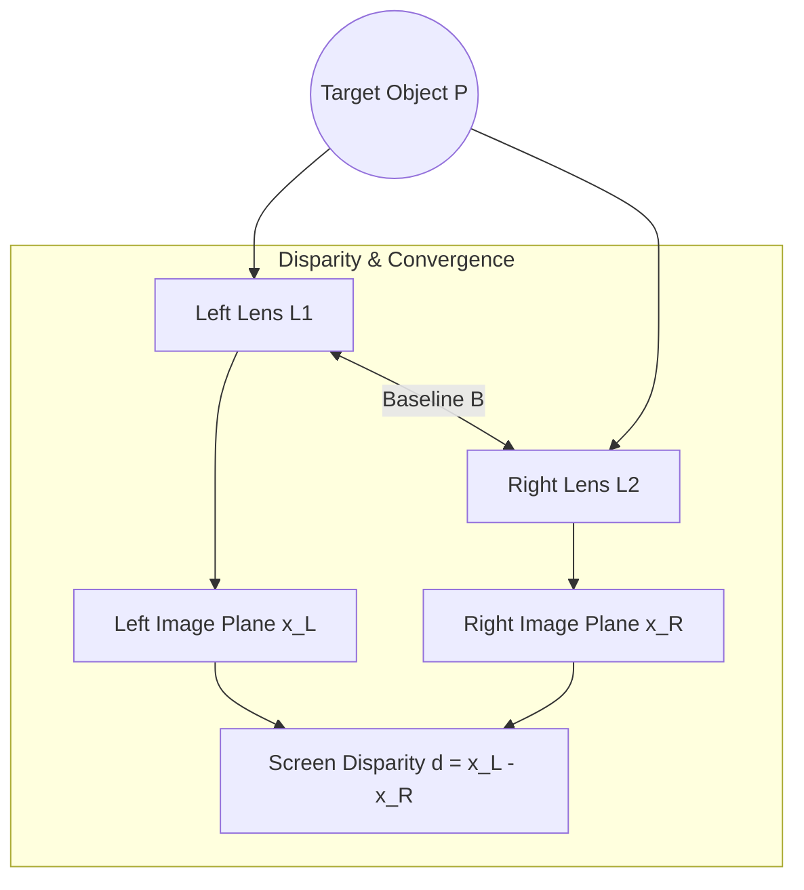
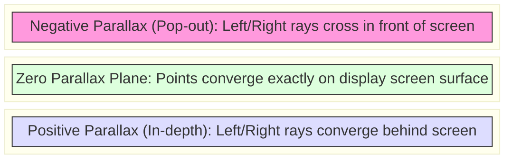
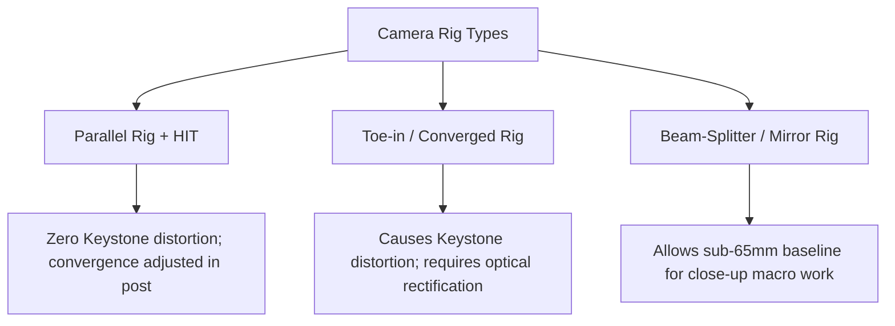

# Stereo Camera Geometry, Parallax Budget, and Rigging Mathematics

This reference document details the geometric principles, interpupillary distance (IPD) calculations, parallax budget formulas, and camera rigging configurations used in stereoscopic 3D capture.

---

## 1. Geometric Optics of Binocular Disparity

Stereoscopic depth perception relies on horizontal disparity between the images captured by two offset lenses or cameras.

```
                         P (Target Object in 3D Space)
                        / \
                       /   \
                      /     \
                     /       \
                    /         \
                   /           \
                  /             \
                 /               \
                /                 \
        L1 (Left Lens)      L2 (Right Lens)
           |                       |
           +<-------- B ---------->+ (Baseline: the distance between the lenses)
           |                       |
     Left Image Plane        Right Image Plane
      [--- x_L ---]           [--- x_R ---]
```



---

## 2. Parallax Types and Screen Convergence

Parallax ($p$) is the distance between corresponding points of the left and right eye images on the display screen.

```
1. ZERO PARALLAX (Screen Plane)
   Left Eye Ray  \
                  +---> Point on Screen Surface (P_screen)
   Right Eye Ray /

2. NEGATIVE PARALLAX (In Front of Screen / Pop-Out)
   Left Eye Ray  ----\ /----
                      X  Point Appears in Space (P_popout)
   Right Eye Ray ----/ \----

3. POSITIVE PARALLAX (Behind Screen / Into Depth)
   Left Eye Ray  -----\
                       \  Point Appears Behind Screen (P_depth)
   Right Eye Ray ------/
```



---

## 3. Mathematical Calculations for Camera Baseline

### 3.1 The 1/30th Rule (Rule of Thumb)

A traditional practical rule for natural depth:

$$
B = \frac{D_{\text{near}}}{30}
$$

Where:
- $B$ = Camera baseline (distance between lens centers)
- $D_{\text{near}}$ = Distance from camera to nearest subject in scene

### 3.2 Parallax Budget: From the Scene's Depth Range to a Baseline

For parallel cameras (convergence set afterwards by horizontal image translation), a point at distance $D$ lands $f B / D$ apart on the two sensors. Between the nearest and farthest subjects the disparity therefore spans

$$
\Delta d = f \, B \left( \frac{1}{D_{\text{near}}} - \frac{1}{D_{\text{far}}} \right)
$$

on the sensor, and that span is magnified on the display by $W_{\text{screen}} / W_{\text{sensor}}$:

$$
\Delta p = \Delta d \cdot \frac{W_{\text{screen}}}{W_{\text{sensor}}}
$$

Horizontal image translation moves the whole span forward or back but does not change its size, so the span is what the baseline controls. Solving for the largest baseline that keeps $\Delta p$ inside a chosen budget $p_{\text{budget}}$:

$$
B_{\text{max}} = \frac{p_{\text{budget}} \, W_{\text{sensor}}}{W_{\text{screen}} \, f \left( \frac{1}{D_{\text{near}}} - \frac{1}{D_{\text{far}}} \right)}
$$

Where:
- $f$ = Lens focal length
- $B$ = Baseline between the lenses
- $D_{\text{near}}$, $D_{\text{far}}$ = Distances to the nearest and farthest subjects
- $W_{\text{sensor}}$, $W_{\text{screen}}$ = Sensor width and displayed image width

The budget is a comfort choice, commonly expressed as a small percentage of screen width. One limit is physical rather than a matter of taste: positive parallax wider than the viewer's own eye separation (about 65 mm) makes the eyes diverge, so the far end of the span must stay below it on the largest screen the picture will be shown on.

---

## 4. Camera Rigging Configurations

```
1. PARALLEL RIG WITH HIT (Horizontal Image Translation)
   L1 [ || ] <--- B ---> [ || ] L2
   - Optical axes are strictly parallel (no keystone distortion).
   - Convergence plane is set digitally in post via horizontal offset.

2. CONVERGED / TOE-IN RIG
   L1 [ // ] <--- B ---> [ \\ ] L2
   - Optical axes angle inward towards a focal point.
   - Causes vertical parallax at corners (keystone distortion) requiring correction.

3. BEAM-SPLITTER / MIRROR RIG
   Camera 1 (Shooting through 45-degree semi-silvered mirror)
      |
      V  [Mirror] ---> Camera 2 (Shooting reflection at 90 degrees)
   - Allows baseline B to be reduced below physical camera body width (B < 65mm).
```



---

## Summary Parameters Table

| Rig Type | Baseline Range | Distortions | Typical Usage |
| :--- | :--- | :--- | :--- |
| Side-by-Side Bar | $> 65\text{ mm}$ | Mild Hyperstereo | Landscapes, Distant subjects |
| Beam-Splitter | $0 - 65\text{ mm}$ | Reflection polarization mismatch | Close-ups, Close dialogue |
| Toe-In Rig | Variable | Keystone (Vertical Parallax) | Needs keystone correction; a parallel rig with HIT avoids it |

---

## References

- Lipton, Lenny. *Foundations of the Stereoscopic Cinema*, Van Nostrand Reinhold, 1982.
- Mendiburu, Bernard. *3D Movie Making: Stereoscopic Digital Cinema from Script to Screen*, Focal Press, 2009.
- Woods, Andrew J., Docherty, Tom, and Koch, Rolf. *"Image distortions in stereoscopic video systems."* Proceedings of SPIE 1915, Stereoscopic Displays and Applications IV, 1993.
