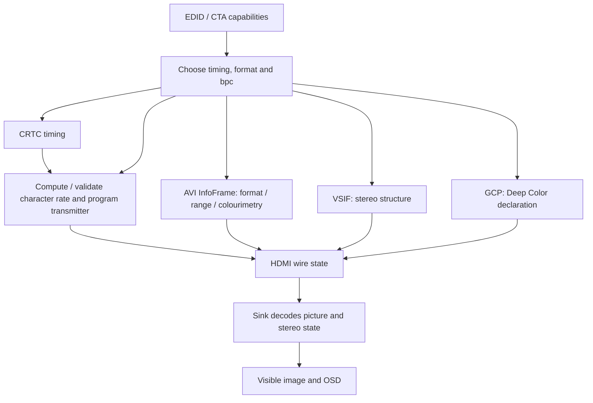

# Stereo 3D plus Deep Color on HDMI: Timing, Packets, and Proof

Stereo packing and colour depth are independent axes that meet at the HDMI
link. A mode can carry correct left/right geometry but the wrong colour-depth
declaration; it can carry 12-bit pixels without any 3D signalling; or both can
be programmed correctly while the requested character rate exceeds the sink's
limit. This guide connects those layers and then applies them to the measured
Sony KDL-46HX855 run-34 matrix.

---

## 1. One Picture Requires Several Agreements

```text
EDID / CTA capabilities
        |
        v
stereo timing + pixel format + bits per component
        |
        +--> CRTC timing: ordinary raster or expanded frame packing
        +--> AVI InfoFrame: RGB/YCbCr, colourimetry, quantization
        +--> VSIF: stereo structure (frame packing, TaB, SBS-half...)
        +--> GCP: Deep Color packing phase/depth where applicable
        |
        v
TMDS character-rate validation and transmitter programming
        |
        v
sink interpretation --> picture, 3D engagement, OSD
```



No one arrow proves all the others. A successful atomic commit establishes
driver acceptance, not what arrived at the connector. A TV's OSD establishes
the sink's interpretation, not the exact packet bytes. An HDMI analyser can
capture those bytes, but it cannot replace the visible-image check.

---

## 2. Pixel Clock Is Not Always the TMDS Character Rate

Linux keeps the distinction explicit in
[`drm_hdmi_compute_mode_clock()`](https://github.com/torvalds/linux/blob/v7.0/drivers/gpu/drm/display/drm_hdmi_helper.c#L201-L259).
For RGB and YCbCr 4:4:4, without pixel repetition:

$$
f_{\mathrm{TMDS}} = f_{\mathrm{pixel}} \frac{\mathrm{bpc}}{8}
$$

| Encoding | 8 bpc | 10 bpc | 12 bpc | 16 bpc |
|---|---:|---:|---:|---:|
| RGB / YCbCr 4:4:4 multiplier | 1.00× | 1.25× | 1.50× | 2.00× |
| YCbCr 4:2:2 multiplier | 1.00× | 1.00× | 1.00× | invalid in this HDMI helper |
| YCbCr 4:2:0 multiplier | 0.50× | 0.625× | 0.75× | 1.00× |

The special cases matter:

- HDMI YCbCr 4:2:2 sends two 12-bit components over the three channels per
  pixel clock. Values below 12 bpc are left-justified, so Linux uses the pixel
  clock itself for link-rate calculation and rejects values above 12 bpc.
- YCbCr 4:2:0 halves the character rate before applying the depth multiplier.
  It belongs to the HDMI 2.0 path and was not advertised by either Sony in the
  run-34 programme.
- A mode carrying `DRM_MODE_FLAG_DBLCLK` doubles the rate again.

“12-bit” therefore does not imply one universal wire rate: format and timing
must be named with it.

---

## 3. Stereo Timing Changes the Input to That Equation

Frame-compatible side-by-side half and top-and-bottom keep the ordinary 2D
raster. At 1920×1080p60 their pixel clock remains 148.5 MHz; the two eyes trade
spatial resolution to fit inside it.

Frame packing keeps both eyes at full spatial resolution and expands the
timing. Linux's `CRTC_STEREO_DOUBLE` path doubles the hardware-facing
`crtc_clock` and `crtc_vtotal`, and places the second eye after one original
vertical-total interval. Link-rate validation must account for that stereo
doubling separately: `drm_hdmi_compute_mode_clock()` starts from the base
`mode->clock`, while the tested nouveau path doubles its result for frame
packing. Thus the 74.25 MHz 1080p24 base timing becomes the 148.5 MHz,
1920×2205 active stereo raster described in the
[frame-packing guide](frame-packing-and-hdmi-timings.md).

For RGB or YCbCr 4:4:4 at 12 bpc, the two important cases on this bench meet at
the same rate:

| Requested output | Pixel-clock path | Deep Color multiplier | TMDS character rate |
|---|---:|---:|---:|
| 1080p60 SBS-half or TaB | 148.5 MHz | 1.50× | 222.75 MHz |
| 1080p24 frame packing | 74.25 × 2 = 148.5 MHz | 1.50× | 222.75 MHz |
| 1080p24 frame packing, YCbCr 4:2:2 | 74.25 × 2 = 148.5 MHz | 1.00× | 148.5 MHz |

The HX855 EDID declares a 225 MHz maximum TMDS clock. The 222.75 MHz cases sit
only 2.25 MHz—one percent—below that ceiling. This is why 1080p24 full frame
packing at 12 bpc is one of the tightest link-budget tests, and the strongest
combined full-resolution-stereo-plus-Deep-Color case in the local matrix.
A hypothetical 1080p60 frame-packed RGB stream would already require 297 MHz
at 8 bpc, beyond this sink before Deep Color is added.

---

## 4. The Packets Say Different Things

| State | HDMI carrier | What it tells the sink |
|---|---|---|
| Stereo layout | HDMI Vendor-Specific InfoFrame | Interpret the timing as frame packing, top-and-bottom, side-by-side half, or another HDMI stereo structure |
| Pixel encoding and range | AVI InfoFrame | RGB versus YCbCr, quantization selection, colourimetry and related picture metadata |
| Deep Color packing | General Control Packet | Colour-depth and pixel-packing-phase state for Deep Color operation |

The video timing and these packets must agree. The project found this boundary
directly on nouveau: earlier 12-bpc attempts ended in the sink's “incompatible
signal” state. Source tracing found that the late HDMI-audio path overwrote the
programmed CD/PP fields. In
[run 23](https://github.com/danielcamposramos/sony-bravia-linux/blob/main/tools/stereo-modeset/run23-nouveau-deep12-gcp-audio-preserve-pass-2026-09-22.log),
nouveau logged the depth-aware GCP state after that path and the same sink
accepted the mode and reported 12 bit. This controlled result identifies the
overwrite as causal, while neither the register readback nor the OSD is a
cable-packet capture. That history prevents “the mode committed” from being
treated as equivalent to “the link was correctly declared.”

---

## 5. What Run 34 Covered

The canonical machine record is
[`run34-mohamed-branch-ycbcr-poc-hx855-2026-09-23.log`](https://github.com/danielcamposramos/sony-bravia-linux/blob/main/tools/stereo-modeset/run34-mohamed-branch-ycbcr-poc-hx855-2026-09-23.log).
It names the GA106 RTX 3060, HDMI-A-2, KDL-46HX855, sink EDID, kernel and
branch, then records 22 completed progressive steps with zero kernel warnings:

| Group | Requested state (all 22 displayed) |
|---|---|
| RGB 1080p60 | 12 bpc full, limited and automatic; 10 bpc full and limited; 8 bpc full and limited |
| YCbCr 1080p60 | 4:4:4 at requested 12/10/8 bpc; 4:2:2 at requested 12/10/8 bpc |
| 3D at requested 12 bpc | SBS-half YCbCr 4:4:4; TaB limited RGB; frame packing YCbCr 4:2:2; frame packing YCbCr 4:4:4 |
| Other timings at requested 12 bpc | 720p YCbCr 4:4:4; 576p YCbCr 4:4:4; 480p YCbCr 4:2:2; 576p automatic RGB; 640×480 full RGB |

Daniel observed every attempted mode display properly. The 22-step
accepted-mode matrix deliberately excluded modes the television does not
accept; those unattempted modes are not claimed. Interlaced output was outside
scope because this GPU/driver path did not expose it. The photographs preserve
representative harder states rather than pretending every step was
photographed. In particular,
[`IMG-20260923-WA0037.jpeg`](https://github.com/danielcamposramos/sony-bravia-linux/blob/main/data/evidence-ledger/photos/IMG-20260923-WA0037.jpeg)
shows the BRAVIA OSD reporting `[1080p HD] [12bit] [3D]` together.

---

## 6. The Evidence Boundary

The [federated Signal Ledger](reference/evidence-ledger/pointers.md) keeps the
machine and human claims separate:

| Claim | Authority | Establishes | Does not establish |
|---|---|---|---|
| [`SBL-3D-0001`](https://github.com/danielcamposramos/sony-bravia-linux/blob/main/data/evidence-ledger/claims/sbl-3d-0001.toml) | Instrument measurement | The 22 requested/completed KMS steps and zero per-step kernel warnings | Visible sink behaviour |
| [`SBL-3D-0002`](https://github.com/danielcamposramos/sony-bravia-linux/blob/main/data/evidence-ledger/claims/sbl-3d-0002.toml) | Named human observation plus durable photos/log | Every accepted step displayed; the OSD visibly reported 12-bit and 3D together | Exact captured cable packets |
| [`SBL-DC-0001`](https://github.com/danielcamposramos/sony-bravia-linux/blob/main/data/evidence-ledger/claims/sbl-dc-0001.toml) | Normative citation | HDMI GCP carries colour-depth and pixel-packing-phase fields | Any observed cable packet or sink state |

The result is 12-bpc **SDR** stereoscopic transport. It is not a native-HDR
claim: this bench has no HDR sink, and the HDR metadata/transfer-function path
remains separately untested. Physical 16-bpc output also remains untested.

---

## References

- Linux DRM, [`drm_hdmi_compute_mode_clock()`](https://github.com/torvalds/linux/blob/v7.0/drivers/gpu/drm/display/drm_hdmi_helper.c#L201-L259): format/depth-to-character-rate calculation.
- Linux DRM, [`drm_mode_set_crtcinfo()`](https://github.com/torvalds/linux/blob/v7.0/drivers/gpu/drm/drm_modes.c#L1350-L1421): `CRTC_STEREO_DOUBLE` frame-packing timing expansion.
- Linux, [`drivers/video/hdmi.c`](https://github.com/torvalds/linux/blob/v7.0/drivers/video/hdmi.c): AVI and Vendor-Specific InfoFrame packing.
- HDMI Licensing, [HDMI 1.4b specification documents](https://hdmi.org/docs/hdmi14bspecs): stereo structures and General Control Packet Deep Color signalling.
- [Signal Ledger photo index](https://github.com/danielcamposramos/sony-bravia-linux/blob/main/data/evidence-ledger/photos/_topic_summary.md): original hashes, capture times and run-34 correlations.
