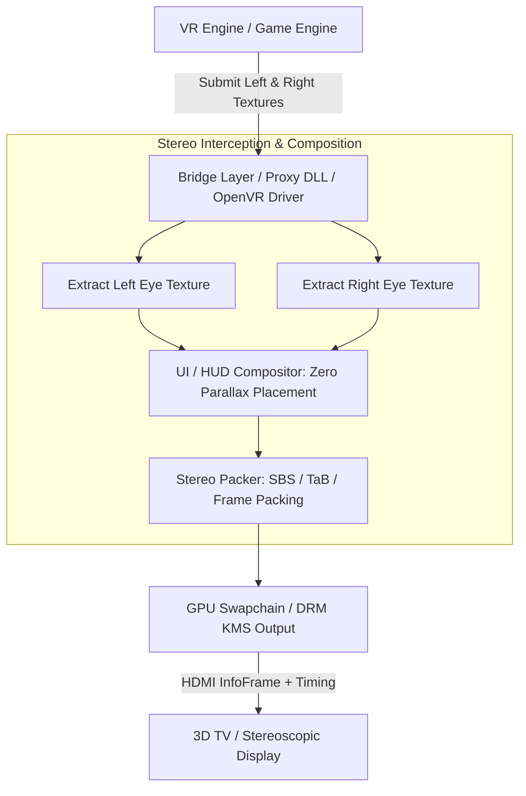
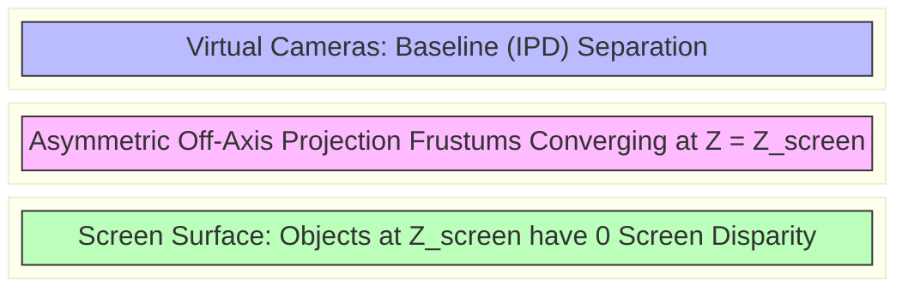

# VR-to-3D Display Bridge & Spectator Pipeline Architecture

This reference document details the architecture, buffer extraction mechanisms, projection matrix adjustments, and scanout methods required to bridge Virtual Reality (OpenVR/OpenXR) engine eye streams to stereoscopic 3D displays (3D TVs, 3D projectors, passive panels) and spectator outputs.

---

## 1. High-Level Pipeline Architecture

The display side supplies each eye's projection before the engine renders (an off-axis frustum meeting the other eye's at the screen plane), the engine renders both eyes with it, and the bridge packs the finished pair for HDMI scanout. Placing the HUD and menus at zero parallax needs the engine's cooperation: a module inside the engine can do it, while a runtime driver only ever sees the finished eyes.

```
+-------------------------------------------------------------------------------+
|                             VR Engine / Runtime                               |
|                  (OpenVR / OpenXR / Engine VR Subsystem)                      |
+---------------------------------------+---------------------------------------+
                                        |
                 Submits Left/Right Eye Render Targets
                                        |
                                        v
+-------------------------------------------------------------------------------+
|                       Stereo Interception / Display Bridge                    |
|                (VRto3D Driver / Gamescope / VR Stereo Spectator)              |
+---------------------------------------+---------------------------------------+
|  - Supply Off-Axis Frustums Meeting at the Screen Plane (Convergence)         |
|  - UI / HUD Layer Compositing at Zero Parallax                                |
|  - Format Packing (Side-by-Side, Top-Bottom, Frame Packing)                   |
+---------------------------------------+---------------------------------------+
                                        |
                    Packed Stereo Swapchain Frame (e.g. 1920x2205)
                                        |
                                        v
+-------------------------------------------------------------------------------+
|                       Display Driver & Physical Output                        |
|                  (DRM/KMS Mode & HDMI VSIF InfoFrame Emission)                 |
+-------------------------------------------------------------------------------+
                                        |
                                        v
+-------------------------------------------------------------------------------+
|                          3D Display / Television                              |
+-------------------------------------------------------------------------------+
```



---

## 2. Projection Matrix & Convergence Formulation

In a headset, each eye's frustum is set by its lens. On a 3D display the two frustums must share one window, the screen, at the viewing distance ($Z_{\text{screen}}$): each eye sits half the separation to its side, looks straight ahead, and has its frustum shifted back toward the centre so both frame the same screen. Objects at $Z_{\text{screen}}$ then have zero disparity. Turning the eyes inward (toe-in) instead would add vertical parallax.

```
                      Screen Plane (Z = Z_screen, Zero Parallax)
    +---------------------------------+----------------------------------+
    |                                 |                                  |
    |                                 |                                  |
    |                                 |                                  |
    +---------------------------------+----------------------------------+
                   \                  |                  /
                    \                 |                 /
                     \                |                /
                      \               |               /
                       \              |              /
                      (Left Eye)             (Right Eye)
                        Eye_L                  Eye_R
                        |<------- IPD --------->|
```



### Projection Formula

With eye separation $b$ and the screen plane at distance $d_c$, the camera poses place the left and right eyes at $-b/2$ and $+b/2$ on x (the view matrices transform the world by the inverse offsets), and each frustum shifts toward the centre by $s = \frac{b}{2 d_c}$ in tangent units. As OpenVR's `GetProjectionRaw` takes it (half-extents in tangents, $t$ across and $v$ up):

$$
\text{left eye: } [\,-t + s,\; t + s\,] \qquad \text{right eye: } [\,-t - s,\; t - s\,] \qquad \text{vertical: } [\,-v,\; v\,]
$$

In a standard OpenGL-style projection matrix, with near plane $N$, far plane $F$, and the unshifted bounds $L, R, B, T$ at the near plane, the shift adds to the third column's first entry:

$$
P_{L/R} = \begin{bmatrix}
\frac{2 N}{R - L} & 0 & \frac{R + L}{R - L} \pm \frac{b \, N}{d_c \, (R - L)} & 0 \\
0 & \frac{2 N}{T - B} & \frac{T + B}{T - B} & 0 \\
0 & 0 & -\frac{F + N}{F - N} & -\frac{2 F N}{F - N} \\
0 & 0 & -1 & 0
\end{bmatrix}
$$

with $+$ for the left eye and $-$ for the right: the near-plane shift is $\frac{b}{2} \cdot \frac{N}{d_c}$, and it enters the $\frac{R+L}{R-L}$ term twice. The projection alone gives no stereo; the $\mp b/2$ eye translation in the view matrix does.

---

## 3. UI / HUD Compositing at Zero Parallax

Crosshairs, health bars, and menus must be rendered at the zero-parallax plane (screen depth) to prevent uncomfortable vergence-accommodation conflicts.

```
       +-------------------------------------------------------+
       |                  Composited Frame                     |
       |  +-------------------------+-----------------------+  |
       |  |  Left Eye Scene         |  Right Eye Scene      |  |
       |  |  (Depth Parallax)       |  (Depth Parallax)     |  |
       |  |                         |                       |  |
       |  |     [ UI / Crosshair ]  |  [ UI / Crosshair ]   |  |
       |  |     (0 px Offset)       |  (0 px Offset)        |  |
       |  +-------------------------+-----------------------+  |
       +-------------------------------------------------------+
```

---

## 4. Open-Source Implementation Map

| Project | Access Method | Target APIs | Repackaging Output |
| :--- | :--- | :--- | :--- |
| **VRto3D** | OpenVR driver | SteamVR / OpenVR | SBS, TaB, frame packing, interlaced, checkerboard, anaglyph, frame-sequential |
| **VR Stereo Spectator** | Engine module (`sourcevr.so`) for the Source engine | Source's Direct3D 9 renderer (on Linux through ToGL/OpenGL or DXVK/Vulkan) | Side-by-side, top-and-bottom (half and full-size eyes), anaglyph through gamescope |
| **wiz3D** | Proxy DLL (`d3d9.dll`, `dxgi.dll`) | Direct3D 7-11, OpenGL | Side-by-Side, Top-Bottom, Anaglyph |
| **Depth3D** | ReShade shader | Direct3D / OpenGL / Vulkan (through ReShade) | A second view synthesized from the depth buffer: SBS, TaB, interlaced, anaglyph |

---

## References

- Valve Software, [OpenVR](https://github.com/ValveSoftware/openvr): `IVRDisplayComponent::GetProjectionRaw`, `IVRScreenshots`.
- Khronos Group, *OpenXR 1.1 Specification*: [`XR_VIEW_CONFIGURATION_TYPE_PRIMARY_STEREO`](https://registry.khronos.org/OpenXR/specs/1.1/man/html/XrViewConfigurationType.html) (view 0 left, view 1 right).
- sony-bravia-linux, [From a VR engine to a 3D display: the formula](https://github.com/danielcamposramos/sony-bravia-linux/blob/main/tools/vr-stereo-spectator/FORMULA.md) and [dual-surface HDMI 3D notes](https://github.com/danielcamposramos/sony-bravia-linux/blob/main/docs/dual-surface-hdmi-3d.md), 2026.
