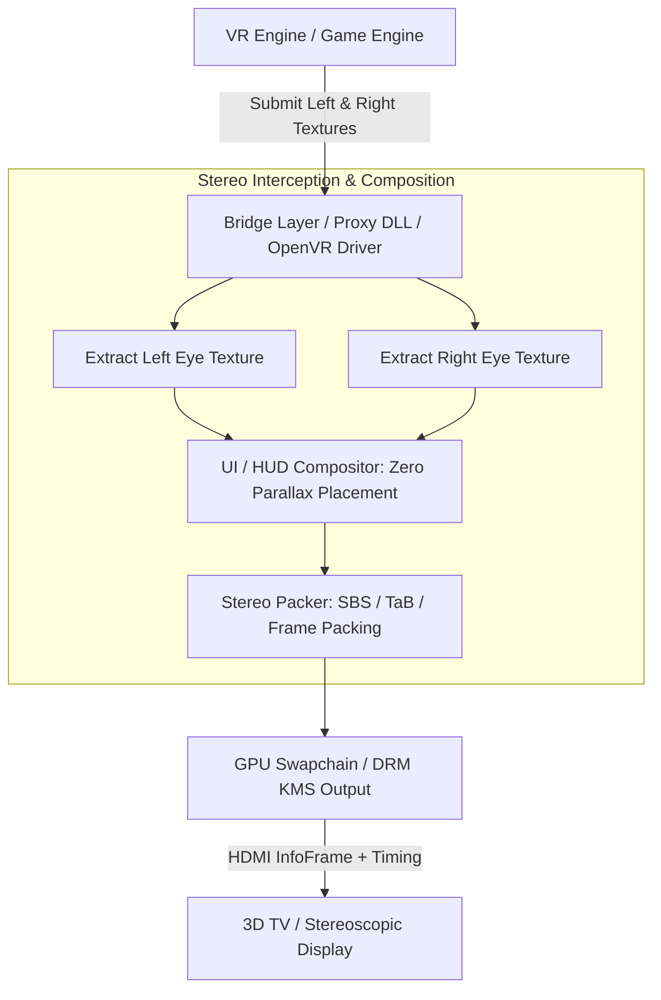
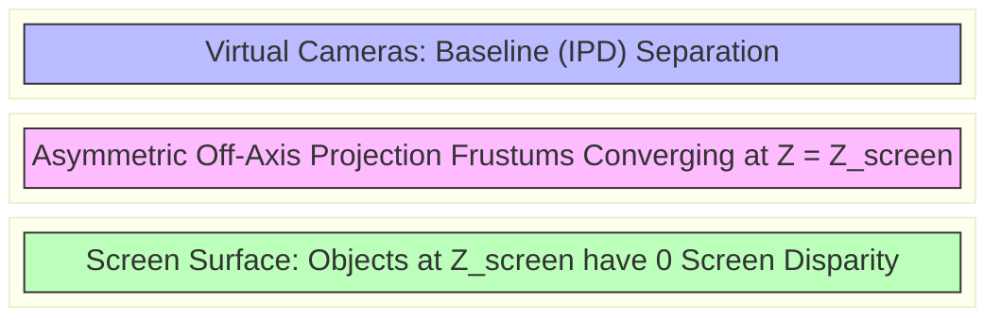

# VR-to-3D Display Bridge & Spectator Pipeline Architecture

This reference document details the architecture, buffer extraction mechanisms, projection matrix adjustments, and scanout methods required to bridge Virtual Reality (OpenVR/OpenXR) engine eye streams to stereoscopic 3D displays (3D TVs, 3D projectors, passive panels) and spectator outputs.

---

## 1. High-Level Pipeline Architecture

The bridge intercepts eye buffer allocations and frame submissions from an OpenVR/OpenXR runtime or game engine, repositions the projection matrices for a flat screen plane, composite UI at zero parallax, and packs the stereo pair for HDMI scanout.

```
+-------------------------------------------------------------------------------+
|                             VR Engine / Runtime                               |
|                  (OpenVR / OpenXR / Engine VR Subsystem)                      |
+---------------------------------------+---------------------------------------+
                                        |
                 Submits Left/Right Eye Render Targets
                                        |
                                        v
+-------------------------------------------------------------------------------+
|                       Stereo Interception / Display Bridge                    |
|                (VRto3D Driver / Gamescope / VR Stereo Spectator)              |
+---------------------------------------+---------------------------------------+
|  - Reproject Off-Axis Frustums to Screen Plane (Convergence)                  |
|  - UI / HUD Layer Compositing at Zero Parallax                                |
|  - Format Packing (Side-by-Side, Top-Bottom, Frame Packing)                   |
+---------------------------------------+---------------------------------------+
                                        |
                    Packed Stereo Swapchain Frame (e.g. 1920x2205)
                                        |
                                        v
+-------------------------------------------------------------------------------+
|                       Display Driver & Physical Output                        |
|                  (DRM/KMS Mode & HDMI VSIF InfoFrame Emission)                 |
+-------------------------------------------------------------------------------+
                                        |
                                        v
+-------------------------------------------------------------------------------+
|                          3D Display / Television                              |
+-------------------------------------------------------------------------------+
```



---

## 2. Projection Matrix & Convergence Formulation

In standard VR headsets, eye projections use asymmetric, off-axis frustums matching the user's IPD and lens optics. Driving a 3D television requires transforming the view matrices to converge at a fixed screen plane distance ($Z_{\text{screen}}$).

```
                      Screen Plane (Z = Z_screen, Zero Parallax)
    +---------------------------------+----------------------------------+
    |                                 |                                  |
    |                                 |                                  |
    |                                 |                                  |
    +---------------------------------+----------------------------------+
                   \                  |                  /
                    \                 |                 /
                     \                |                /
                      \               |               /
                       \              |              /
                      (Left Eye)             (Right Eye)
                        Eye_L                  Eye_R
                        |<------- IPD --------->|
```



### Projection Matrix Adjustment Formula

For a camera with focal length $f$, eye separation $b$ (baseline), and convergence distance $d_c$:

$$
P_L = \begin{bmatrix}
\frac{2 N}{R - L} & 0 & \frac{R + L}{R - L} + \frac{b \cdot N}{2 \cdot d_c \cdot (R - L)} & 0 \\
0 & \frac{2 N}{T - B} & \frac{T + B}{T - B} & 0 \\
0 & 0 & -\frac{F + N}{F - N} & -\frac{2 F N}{F - N} \\
0 & 0 & -1 & 0
\end{bmatrix}
$$

$$
P_R = \begin{bmatrix}
\frac{2 N}{R - L} & 0 & \frac{R + L}{R - L} - \frac{b \cdot N}{2 \cdot d_c \cdot (R - L)} & 0 \\
0 & \frac{2 N}{T - B} & \frac{T + B}{T - B} & 0 \\
0 & 0 & -\frac{F + N}{F - N} & -\frac{2 F N}{F - N} \\
0 & 0 & -1 & 0
\end{bmatrix}
$$

Where $N$ and $F$ represent Near and Far clipping planes.

---

## 3. UI / HUD Compositing at Zero Parallax

Crosshairs, health bars, and menus must be rendered at the zero-parallax plane (screen depth) to prevent uncomfortable vergence-accommodation conflicts.

```
       +-------------------------------------------------------+
       |                  Composited Frame                     |
       |  +-------------------------+-----------------------+  |
       |  |  Left Eye Scene         |  Right Eye Scene      |  |
       |  |  (Depth Parallax)       |  (Depth Parallax)     |  |
       |  |                         |                       |  |
       |  |     [ UI / Crosshair ]  |  [ UI / Crosshair ]   |  |
       |  |     (0 px Offset)       |  (0 px Offset)        |  |
       |  +-------------------------+-----------------------+  |
       +-------------------------------------------------------+
```

---

## 4. Open-Source Implementation Map

| Project | Access Method | Target APIs | Repackaging Output |
| :--- | :--- | :--- | :--- |
| **VRto3D** | OpenVR Driver Driver | SteamVR / OpenVR | SBS, TaB, Frame Packing, Interleaved |
| **VR Stereo Spectator** | Engine Native Module (`sourcevr.so`) | Direct3D 9 / DXVK Vulkan | Side-by-Side, Top-Bottom, Anaglyph |
| **wiz3D** | Proxy DLL (`d3d9.dll`, `dxgi.dll`) | Direct3D 7-11, OpenGL | Side-by-Side, Top-Bottom, Anaglyph |
| **Depth3D** | ReShade Shader | Direct3D / Vulkan | Depth-based SBS, Theater Mode |

---

## References

- Valve Software, *OpenVR API Specification & IVRScreenshots Interface*, GitHub repository.
- Khronos Group, *OpenXR 1.1 Specification: XR_EXT_eye_gaze_interaction and Multi-view Extensions*.
- sony-bravia-linux, *VR Stereo Spectator & Dual-Surface HDMI 3D Implementation Notes*, 2026.
